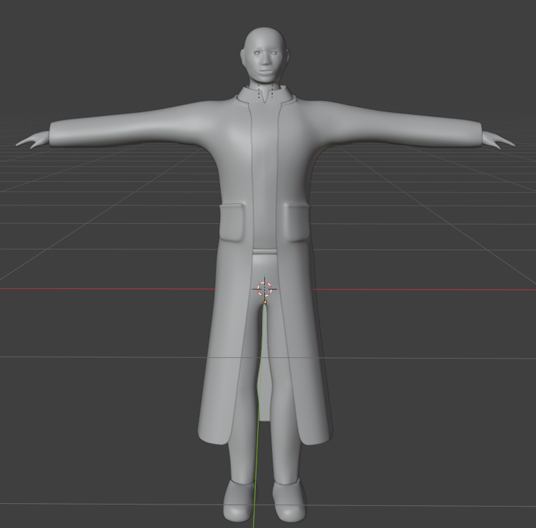
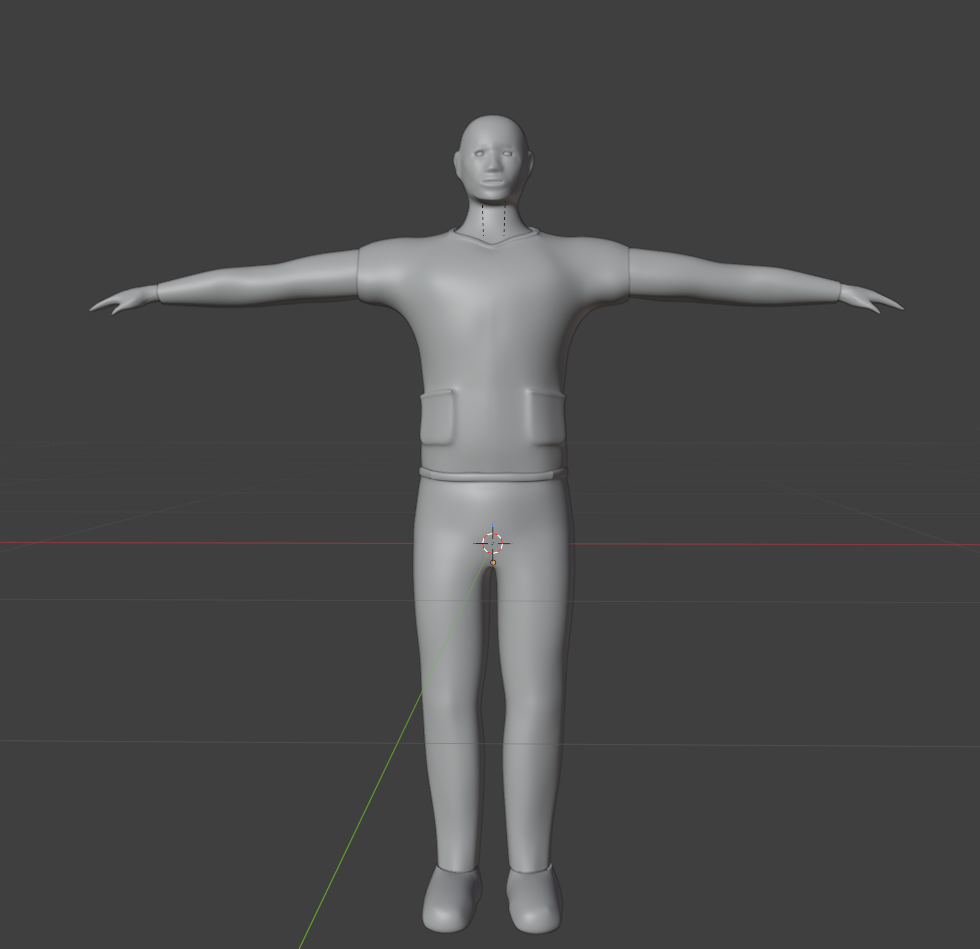
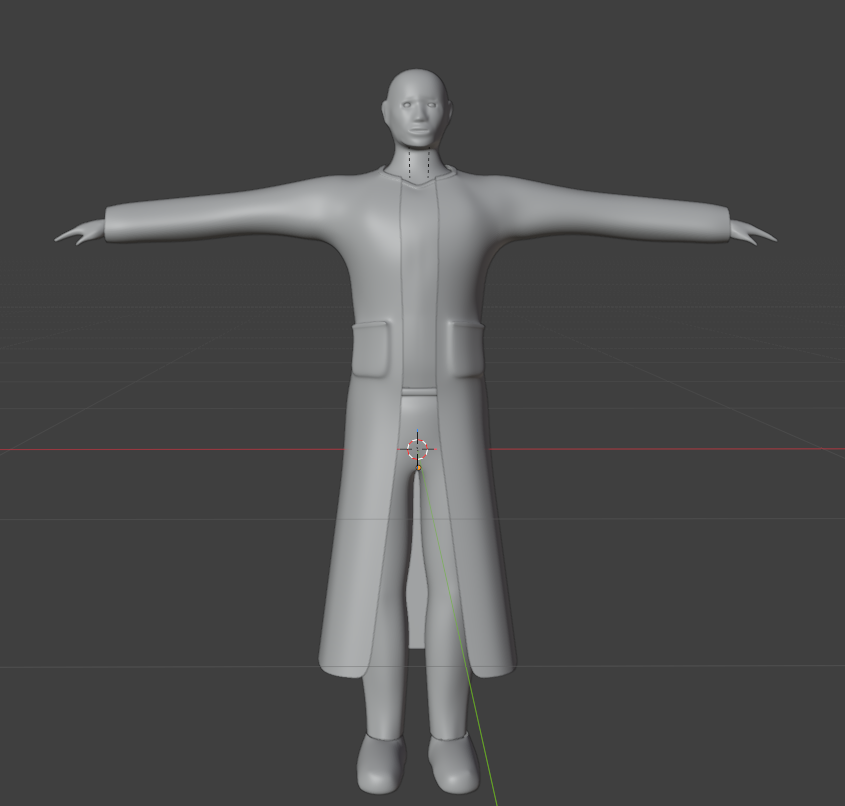
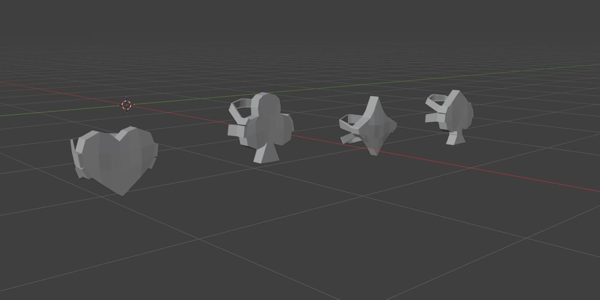

# Nicole Golias Ribeiro

  

    <a href="#home"><b>Início</b></a> • 
    <a href="#projetos"><b>Sobre mim</b></a> • 
    <a href="#perfil"><b>Projetos</b></a> • 
    <a href="#contato"><b>Competências</b></a> • 
    <a href="#perfil"><b>contato</b></a> 
  

 

<table border="0">
  <tr>
    <td>
      
    </td>
    <td valign="top" style="padding-left: 20px;">
      <h2>Sobre Mim</h2>
      
Desenvolvedora focado em <b>Jogos Digitais</b> </b>.

      
Estudante de jogos digitaisna Fatec Ourinhos 

      
Artista 3D/2D

      

      
21 Anos

      
Ourinhos SP

       
      <a href="#contato"><b>Entre em contato →</b></a>
    </td>
  </tr>
</table>

---

  

<h2 id="projetos">📂 Projetos Desenvolvidos</h2>

Confira abaixo alguns dos meus principais trabalhos acadêmicos e pessoais:

<table border="0">
  <tr>
    <td width="50%" align="center" style="border: 1px solid #30363d; border-radius: 10px; padding: 10px;">
      
       
      <b>👾 The Truth About Alice</b>
      
Dr.Tarrant

  </tr>

   <tr>
    <td width="50%" align="center" style="border: 1px solid #30363d; border-radius: 10px; padding: 10px;">
      
       
      <b>👾 The Truth About Alice</b>
      
Enfermeiro

  </tr>

   <tr>
    <td width="50%" align="center" style="border: 1px solid #30363d; border-radius: 10px; padding: 10px;">
      
       
      <b>👾 The Truth About Alice</b>
      
Médico

  </tr>

  <tr>
    <td width="50%" align="center" style="border: 1px solid #30363d; border-radius: 10px; padding: 10px;">
      
       
      <b>👾 The Truth About Alice</b>
      
Máscaras

  </tr>
  
</table>

  

<b>Habilidades Técnicas:</b>

<ul>
  <li>Escultura Digital & Retopologia (High-poly e Low-poly) na ferramenta Blender.</li>
  <li>Pintura e texturização na ferramenta Substance painter.</li>
  <li>Arte 2D na ferramente piskel.</li>
  <li>Arte vetorizada na ferramenta Inkscape.</li>
</ul>

  

<h2 id="contato">✉️ Página para Contato</h2>

Sinta-se à vontade para entrar em contato para trocarmos ideias ou oportunidades!

  

---

  <a href="#home">🔺 Voltar ao topo</a>

